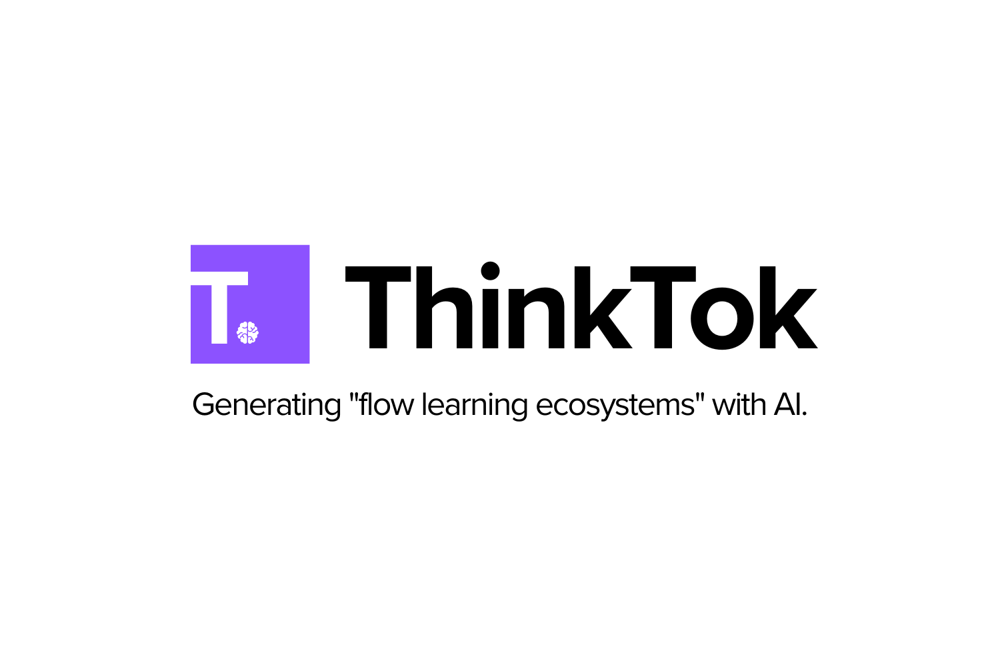

## The problem with learning today
Students with ADHD face many obstacles to their learning. Many of these students have difficulty
focusing and paying attention when reading larger texts, such as textbooks, research papers, or textbooks. *We need a better way to help these students learn*.

## Summaries are not the solution
We believe that summaries still require a lot of necessary focus and attention, maybe even more than reading the actual text. Summaries bombards readers with a bunch of important points, with not a lot of time to really digest. *It is not the solution*.

## Flow learning ecosystems are the key
We need an environment where learning is neuro-stimulating. This is where what we coin "flow learning ecosystems" comes in. Flow learning ecosystems are networks/"link" of a series of cards that flow from one to the other to create an *action-filled story*. It invokes a scrolling style similar to reddit.

## Where ThinkTok comes in
ThinkTok is an online platform that allows anyone to upload their textbook and research paper and autonomously generate a flow learning ecosystem. It creates a *network of users and personalities* with long-term memory to help tell a story to convey the knowledge point. Like in social media, user learns by scrolling through a constant stream of interesting posts and comments.

## How we made it
Our AI stack is made up of vector embeddings and GPT chat completion from OpenAI for our personality responses/posts, and LanceDB for our vector database. LanceDB provides *long-term memory and context* for both the textbook and our user personalities. Our frontend is React and our backend is NodeJS.

## Get started
1. Install server
```
cd server
npm install
```
2. Add OPENAI_API_KEY env variable in a `.env` file in `server/`
.env
```
OPENAI_API_KEY=[YOUR_KEY_HERE]
```
3. Install ui (go back to main directory)
```
cd ui
npm install
```
4. Run server and ui (go back to main directory)
```
cd ui
npm run start
cd ../server
node index.js
```